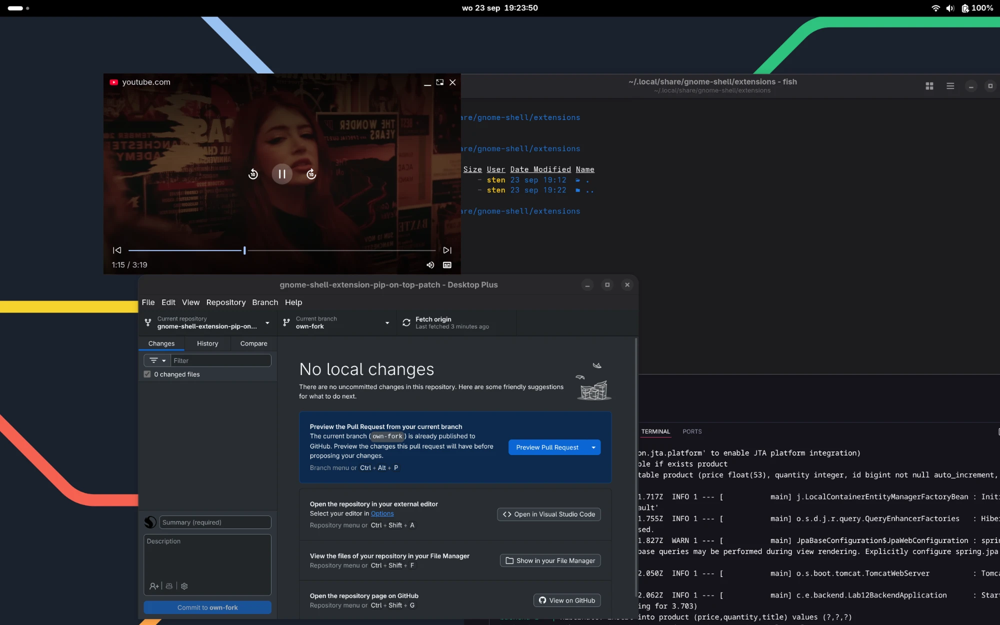

# gnome-shell-extension-pip-on-top


> **Note:** This is [Stensel8's](https://github.com/Stensel8) actively maintained fork of the original extension. The upstream maintainer has been inactive for a while and pull requests there aren't being merged, so fixes and improvements land here first. Credit for the original extension goes to [Rafostar](https://github.com/Rafostar/gnome-shell-extension-pip-on-top).

Keeps "Picture-in-Picture" windows always on top in Wayland sessions. PiP windows are detected by their window title, so most players are supported, including Firefox, Chromium based browsers (Brave, Chrome, Yandex.Browser), Telegram Desktop and the Clapper media player.

Please note that X11 sessions may work, but it is not supported or maintained.

[](https://extensions.gnome.org/extension/11013/pip-on-top-patch/)

(The original extension has its own separate listing at [extensions.gnome.org/extension/4691/pip-on-top](https://extensions.gnome.org/extension/4691/pip-on-top) — that one tracks upstream, not this fork.)



## Installation

### From extensions.gnome.org
Use the badge above, or install the [browser extension](https://extensions.gnome.org/extension/11013/pip-on-top-patch/) and toggle it on from that page.

### From source
```sh
git clone --branch own-fork "https://github.com/Stensel8/gnome-shell-extension-pip-on-top-patch.git"
cd gnome-shell-extension-pip-on-top-patch
```

If you're running Firefox in a language other than English, generate translations **before** installing, so `install.sh` picks them up:
```sh
chmod +x translate.sh
./translate.sh
```

Then install:
```sh
./install.sh
```
`install.sh` copies the extension into `~/.local/share/gnome-shell/extensions/` under the right UUID and compiles its schema for you. If you run `translate.sh` afterward, re-run `./install.sh` to pick up the generated translations.

After all is done: logout, login back (or reboot) and enable the extension with `gnome-extensions enable pip-on-top-patch@stensel8.github.io` (or via the Extensions app). Enjoy!
